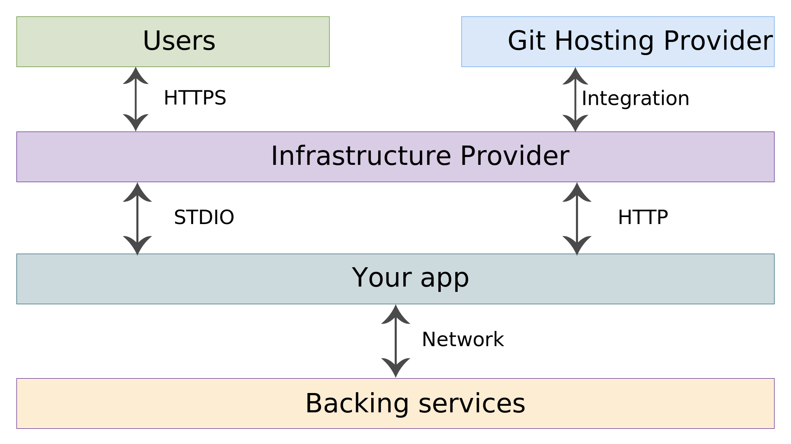
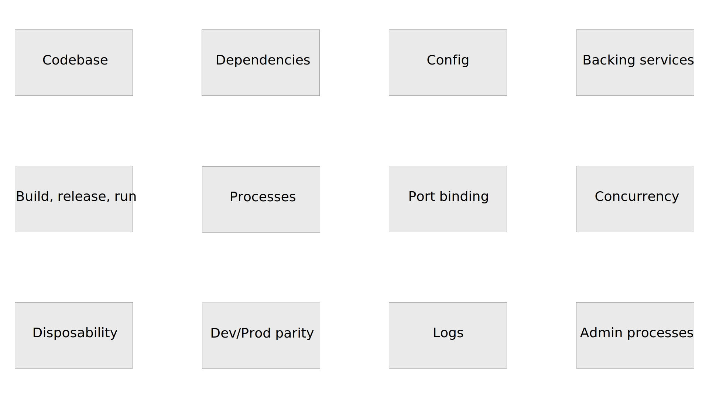

layout: true
class: middle

---

# The world of 12-factor apps

[p.2hog.codes/12-factor](https://p.2hog.codes/12-factor)

---

# About 2hog.codes

* Founders of [SourceLair](https://www.sourcelair.com) online IDE + Dimitris Togias
* Docker and DevOps training and consulting

---

# Antonis Kalipetis

* Docker Captain and Docker Certified Associate
* Python lover and developer
* Technology lead at SourceLair, Private Company

.footnote[[@akalipetis](https://twitter.com/akalipetis)]

---

# Paris Kasidiaris

* Python lover and developer
* CEO at SourceLair, Private Company
* Docker training and consulting

.footnote[[@pariskasid](https://twitter.com/pariskasid)]

---

# Dimitris Togias

* Self-luminous, minimalist engineer
* Co-founder of Warply and Niobium Labs
* Previously, Mobile Engineer and Craftsman at Skroutz

.footnote[[@demo9](https://twitter.com/demo9)]

---

class: center

# [p.2hog.codes/12-factor](https://p.2hog.codes/12-factor)

---

# Agenda

1. Background, Motivation and the 12 factors
2. Topology and Examples
3. 12-factor apps with Docker

---
class: center

# Background, Motivation and the 12 factors
    
---

# The 12-factor methodology

A methodology for building scalable, durable and maintanable apps.
    
---

# Background

The 12-factor methodology was proposed by Adam Wiggins, then CTO of Heroku in 2011.

Essentially, it describes the contract between Heroku and the apps deployed on it.

---

# Motivation

There was need for a set of concepts for building **scalable**, **durable** and **maintainable** web apps.

---

# Goal

Clean contract between the app and the infrastructure that will enable

- The infrastructure provider to take care of **scalability** and **durability**
- Fast, continuous and predictable deployments from development to production

---

# Principles

The 12-factor methodology has its foundation in well-established principles

- [UNIX Process Model](https://devcenter.heroku.com/articles/process-model)
- [Shared Nothing Architecture](http://en.wikipedia.org/wiki/Shared_nothing_architecture)

---

# Scalability issues

1. Applications hard-wired to servers (and consequently to disks, IPs etc.)
2. Manual handling of load balancing
3. Hard to implement zero-downtime deployments

---

# Maintainability issues

1. Less predictable deployments from development to production
2. Devious set up of Continuous Integration and Continuous Delivery pipelines

---

# Durability issues

1. In-house implementation of firewalls etc.
2. Infrastructure maintenance (security updates, cleaning etc.)

---

# The 12 factors

---

# I. Codebase

One codebase tracked in revision control, many deploys.


https://12factor.net/codebase

---

# II. Dependencies

Explicitly declare and isolate dependencies.

This is being done with language specific tools like:

- Pipenv for Python
- Yarn for JavaScript
- Bundler for Ruby
- Cargo for Rust, etc.

https://12factor.net/dependencies

---

# III. Config

Store config in the environment (or not!).

https://12factor.net/config

---

# IV. Backing Services

Treat backing services as attached resources.


https://12factor.net/backing-services

---

# V. Build, Release, Run

Strictly separate build and run stages.


https://12factor.net/build-release-run

---

# VI. Processes

Execute the app as one or more stateless processes.

https://12factor.net/processes

---

# VII. Port Binding

Export services via port binding.

> **The 12-factor app is completely self-contained**. It exports HTTP as a service by binding to a port, and listening to requests coming in on that port.

https://12factor.net/port-binding

---

# VIII. Concurrency

Scale out via the process model.

.

https://12factor.net/concurrency

---

# IX. Disposability

Maximize robustness with fast startup and graceful shutdown.

https://12factor.net/disposability

---

# X. Dev / Prod Parity

Keep development, staging, and production as similar as possible.

https://12factor.net/dev-prod-parity

---

# XI. Logs

Treat logs as event streams.

https://12factor.net/logs

---

# XII. Admin Processes

Run admin/management tasks as one-off processes.

https://12factor.net/admin-processes

---

# Topology

class: center



---

# A few before/after examples

---

# PHP: before/after

- **Before**: Run PHP embedded in Apache via `mod_php`
- **After**: Run PHP as a standalone process via `php-fpm`

---

# Configuration: before/after

- **Before**: Write a custom configuration file for your app
- **After**: Use a environment variable to store each setting of your app

---

# Logging: before/after

- **Before**: Write logs in `/var/log/...` and collect them with Logstash
- **After**: Write all logs in `stdout/stderr` and let the infrastructure provider collect them

---

# 12-factor apps in Docker-land

---

# 12-factor recap

class: center



---

# Codebase in Docker

The codebase is tracked in a Git repository and usually embedded in the Docker image

```dockerfile
ADD . /usr/src/app
```

---

# Dependencies in Docker

Application dependencies should be downloaded when building your Docker Image and be embeded in it.

```dockerfile
RUN bundle install
```

---

# Config in Docker

Docker lets you pass environment variable configuration to your containers via the [`-e`](https://docs.docker.com/engine/reference/run/#env-environment-variables) flag.

```sh
docker run -d -e DATABASE_URL=postgres://... myapp
```

---

# Backing Services in Docker

Docker Containers can access external backing services, without additional configuration.

With Docker though we can run our own backing services as well.

```sh
docker run -d --name=db -e POSTGRES_PASSWORD=lepassword postgres
docker run -d --link db -e DATABASE_URL=postgres://... myapp
```

---

# Build, Release, Run in Docker

Build with [`docker build`](https://docs.docker.com/engine/reference/commandline/build/).
Release and run with [`docker run`](https://docs.docker.com/engine/reference/commandline/run/).

```sh
docker build -t myapp .
docker run -d -e DATABASE_URL=postgres://... myapp
```

---

# Processes in Docker

Docker Containers have 1-1 relationships with Processes in the 12-factor methodology.

```sh
docker run -d myapp
```

---

# Port Binding in Docker

Docker lets you expose ports used inside the container to ports

```sh
docker run -d -p 8000 myapp
```

---

# Concurrency in Docker

Docker lets you run multiple instances with the same configuration.

It can even handle exposing the same internal port to different external ones!

```sh
docker run -d --name=app.1 -p 8000 myapp
docker run -d --name=app.2 -p 8000 myapp
```

---

# Disposability in Docker

Docker Containers should always be disposable and not rely on the file system for storage.

You can ensure that by running your containers using the `--read-only` flag

```sh
docker run -d --read-only myapp
```

---

# Dev / Prod Parity in Docker

Docker images are content-addressable.

Running the same command in the same Docker image should produce the same result across any system.

---

# Logs in Docker

Docker captures all output sent to `stdout` and `stderr` and stores it in its log storage or [in an external one](https://docs.docker.com/config/containers/logging/configure/).

You can access and inspect your container's logs via [`docker logs`](https://docs.docker.com/engine/reference/commandline/logs/).

```sh
docker logs --tail 15 -f 70a8a161
```

---

# Admin Processes in Docker

You can run administrative one-off commands in running Docker containers using [`docker exec`](https://docs.docker.com/engine/reference/commandline/exec/).

```sh
docker exec -ti 70a8a161 rails db:migrate VERSION=20080906120000
```

---
class: center

# Thanks!
