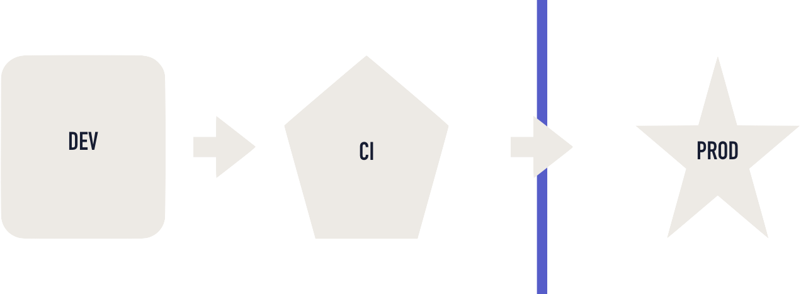

layout: true
class: middle

---

# Introduction to Continuous Integration in the Container World

--

[p.2hog.codes/ci-cd-containers](https://p.2hog.codes/ci-cd-containers)

---

# About 2hog.codes

* Founders of [SourceLair](https://www.sourcelair.com) online IDE + Dimitris Togias
* Docker and DevOps training and consulting

---

# Antonis Kalipetis

* Docker Captain and Docker Certified Associate
* Python lover and developer
* Technology lead at SourceLair / stolos.io
* Docker training and consulting

.center[I love automating stuff and sharing knowledge around all things containers, DevOps and optimizing developer workflows.]

.footnote[[@akalipetis](https://twitter.com/akalipetis)]

---

# Paris Kasidiaris

* Python lover and developer
* CEO at SourceLair, Private Company
* Docker training and consulting

.footnote[[@pariskasid](https://twitter.com/pariskasid)]

---

# Dimitris Togias

* Self-luminous, minimalist engineer
* Co-founder of Warply and Niobium Labs
* Previously, Mobile Engineer and Craftsman at Skroutz

.footnote[[@demo9](https://twitter.com/demo9)]

---

# Agenda

1. The art of continuous integration with Docker
1. Continuous delivery
1. The DevOps dream
1. Intro to CI servers and Drone CI
1. Exercise: Setting up a containerized CI/CD system
1. Case study: from monoliths to a containerized infrastructure

---

class: center

# The art of continuous integration

---

# What is continuous integration?

--

Continuous Integration (CI) is a development practice that requires developers to integrate code into a shared repository several times a day. Each check-in is then verified by an automated build, allowing teams to detect problems early. 

.footnote[[https://www.thoughtworks.com/continuous-integration](https://www.thoughtworks.com/continuous-integration)]

---

# Why should I care about CI?

--

* Save time, by making sure at every point in time that you have working software
* Find bugs and issues early on and crash them
* After-the-fact debugging is a huge waste of time
* Stop guessing that things work, be sure about your code
* Increase your software delivery speed, by automating part of the process

---

# Does all this come for free?

--

No.

--

* You need to make sure your code is thoroughly tested
* You need to make sure your code testing environment resembles production
* You need to setup your CI pipelines
* You need to have processes in place for how things should work

---

# Going the extra mile

--

* You need to bring production(-like) data into testing
* You need to stress-test your environment, with load testing or custom tools

???

* Locust, Vegeta, gobench and more

---

# CI tips

--

* Everything should be automated
* Source code hosting integration should be in place
* A branching strategy should be defined in advance
* Make sure you save your CI configuration in a file (or files) within each repository

---

# Automate all the things

--

* Hook CI jobs on commits, pushes and pull requests
* Block merges if the CI jobs does not pass
* Report results back to your source code hosting system

---

# Branch your way out of confusion

* Having a branching strategy is critical, as it defines the flow of your code before it reaches production
* Start with an existent system, salt to taste
* Include information about your branching strategy in CONTRIBUTING.md

???

Existing strategies:

* Git flow (master, develop, feature/X, hotfix/X)
* Github flow (master, feature/X)

---

# Docker + CI tips

--

* Use commits and tags to name images
* Use Docker Compose template variables for different environments
* Optimize your Docker images

---

class: center

# Building efficient Docker images

---

# Base your images to lightweight images

--

* You base images might include a lot of bloat, that you probably do not need
* Your Docker images do not need to include everything you might think of
* You probably do not need a full OS to run your simple process

---

# Let's see an example

--

```
docker pull centos
docker pull alpine
docker image inspect centos --format '{{ .Size }}' | awk '{print $1 / 1024 / 1024, "MB"}'
docker image inspect alpine --format '{{ .Size }}' | awk '{print $1 / 1024 / 1024, "MB"}'
```

---

# Keep the same base image for most of your applications

--

* Start with a base image from Docker Hub
* Create your own base image on top of it
* Try to use this as the base image for all your applications

???

Even if the base image is large enough, basing all images of it allows for quicker pulls and less storage
Keeping up with security updates is easier if you make sure your base images is always secure

---

# Do not add stuff you do not need

--

* Don't add a debugger, you won't debug your containers
* Don't add cURL

???

* If you need to add a debugging tool to debug a container, you can do it on-demand when you need it
* Adding tools you might not need increases the image size, the attack surface and makes builds slower

---

# Group commands to optimize layers

--

* Group commands that do a clean up
* Otherwise, you'll still ship the "large" layer with your image
* Each image layer only _adds up_ space, it doesn't truncate it

---

# Let's see an example

--

```
# Dockerfile.split
FROM alpine:latest
RUN apk add -U bind-tools
RUN rm -f /var/cache/apk/*
```

```
# Dockerfile.grouped
FROM alpine:latest
RUN apk add -U bind-tools && \
    rm -f /var/cache/apk/*
```

--

```
docker build -t split --file=Dockerfile.split .
docker build -t grouped --file=Dockerfile.grouped .
docker image inspect split --format '{{ .Size }}' | awk '{print $1 / 1024 / 1024, "MB"}'
docker image inspect grouped --format '{{ .Size }}' | awk '{print $1 / 1024 / 1024, "MB"}'
```

---

# Optimize cache

--

* Place commands that break the cache further down the Dockerfile
* Place commands that are time-consuming but do not change often at the top

---

# Let's see an example

```
# Dockerfile.simple
FROM python:3.6
WORKDIR /code
ADD . /code
RUN pip install -r requirements.txt
```

--

```
# Dockerfile.cached
FROM python:3.6
WORKDIR /code
ADD requirements.txt /code/requirements.txt
RUN pip install -r requirements.txt
ADD . /code
```

???

* Although we're creating one more layer, the final image can utilize cache better
* Caching helps a lot during development and CI, as it speeds builds up

---

# Use multi-stage builds

--

* Start from a thin image
* Add all needed dependencies to build your artifact
* Start again, from a smaller image
* Copy your artifact
* Produce a thinner final image

---

# Multi-stage build examples

--

* Builds a {JAR, Go/C/C++ binary}, copy it over
* Build some static assets with Node for your {Python, Go, you-name-it} application
* Build a needed library, with lots of dependencies

---

class: center

# Continuously delivering

---

# Continuous delivery

--

* Automatically deploy version of your software, when code is pushed to certain branches
* Use branches as a reference on what is deployed
* Use git to handle deployments — GitOps

---

# Why deliver continuously

--

* Decrease the lines of code deployed each time, decreasing chances for error
* Easily roll-back to previous versions, as changes are minimal
* Ship features faster, increasing your time to market
* Increase confidence when releasing new software
* Easy rollbacks, as they're nothing more than a new release

---

# How to delivery continuously

--

* Hook deployments to your CI system
* Deploy automatically, at least to a staging/QA environment
* Break things and fix things!

---

# Tips on continuous delivery

--

* Many CI systems have deployments as a first class citizen, use them
* Use your CI as a log for what happened in your environments
* Even if you don't continuously deliver on your production environment, make sure you use your CI system and the same tooling

---

# The DevOps dream

---

# Getting from here

.center[]

--

# To here

.center[]

---

# Why have the same environment everywhere?

--

* Avoid works-on-my-machine excuses — it should work everywhere in the same way
* Easily test new features, as the whole stack can run from your local computer, to your CI
* Speed up project onboarding time

---

# Optimizing your delivery pipeline

* Same runtime in development, CI and production
* Use the same declarative format all the way
* Focus on what you do best

???

* Docker Compose works both in one node and Docker Swarm
* Developers should code
* Ops should manage infrastructure
* Application management is left to the Swarm

---

# Docker as a runtime and image format

--

* Allows for easily distributing a runnable unit in different environments
* Docker containers always run in the same way

---

# The local toolchain

--

* Docker for Mac/Windows
  * Native support for the OS
* Docker Compose
* Auto reloading web servers
  * Nodemon, gin, Django, Flask, etc
* docker-compose up and be ready to go

---

# Using Docker Compose override files

--

* Allows for same base file, adding some development tweaks
* No need to manage multiple files or repos
* Same stack definition for development and production

???

* Open the docker-compose.yml and docker-compose.override.yml files
* See how simple it is to override

---

# Docker in your CI system

--

* Use the same Docker Compose file to run your tests
* Spin up a test infrastructure in no time and tear it back down
* Do not maintain external testing infrastructure, requiring your build agents to synchronize

---

# Anatomy of CI software

--

* Server
* Agents
* Jobs / Builds
* Pipelines

---

# Server

--

* Stores all the information about our CI
* Has (probably) a UI for all this information
* Receives hooks from code hosting websites on code changes
* Orchestrates agents to run jobs / builds

---

# Agents

--

* Run jobs / builds and report back to the CI server
* Are scaled up / down based on demand for jobs / builds

---

# Jobs / Builds

--

* Are the actual unit of work that needs to run
* Are triggered by an event, ie: commit, pull request, tag

---

# Pipelines

--

* Collection of steps to be run within a job / build
* Can either skip or ignore step results based on branches

---

# Drone CI

https://drone.io/

---

# Drone CI

* Easy to use
* Quick installation
* File-based
* Containerized jobs
* OAuth authentication from external system

---

# Containerized jobs

* Drone CI uses Docker images by default for the jobs
* Each pipeline step can be run in a different image

---

# Drone key concepts

--

* Secrets — a way to use secret information in pipelines
* Plugins — find (or build) anything you want with just a Docker image

---

# An example Drone pipeline

--

[git.io/fwlt1](https://git.io/fwlt1)

---

class: center

# Let's exercise our skills

--

Let's create a continuously integrated and delivered application.

---

# What we'll need

* [A Github account](https://github.com/)
* [A Github OAuth app token](https://github.com/settings/developers)

---

# Create a Dockerfile

* Fork https://github.com/akalipetis/python-example
* Clone it locally
* Create a Dockerfile

---

# Create a docker-compose.yml file

* Add image (username/repository) and command directives
* Expose port 5000

---

# Create a docker-compose.override.yml file

* Add build directives
* Mount local code for faster development

---

# Run tests using Docker Compose

* Use `docker-compose run ...`

---

# Deploy your stack

* `docker stack deploy`
* Check that everything is working

---

# Create a .drone.yml file that

* Builds the image
* Runs tests
* Deploys our stack

---

# Deploy Drone

* Create a yaml file from: https://git.io/fwlt1 
* `export DRONE_HOST=http://workshop-vm-ID-00.akalipetis.com`
* `export DRONE_GITHUB_CLIENT=XXX`
* `export DRONE_GITHUB_SECRET=YYY`
* Deploy the stack

---

# Setup Drone

Go to http://workshop-vm-ID-00.akalipetis.com, log in and enable your new repository

---

# See the pipeline in action

* Push a new commit and see it work!

---

class: center

# Case study: from monoliths to a fully-containerized infrastructure

---

# The stack

--

* Classic Java monoliths
* Deployed to customer servers by people
* Minimal automation, mainly with scripts

---

# The need

--

* A SaaS-like service, serving the same purpose as the customer-deployed products
* Quicker iterations on new versions and features
* Multiple deployed versions of the software at once
* Easy scale up/down of specific components

---

# The answer

--

Docker all the things!

---

# First, baby steps

--

* Put everything in a container
* Create supporting software to make it work as we pleased

---

# Get a PoC ready

--

* Create a container cluster
* Deploy the monolith (in a container)
* Showcase that things can work in containers too

---

# Start splitting

--

* Split parts that are not needed by the new service
* Make logical splits, where things should be separated or scaled differently

---

# Create a continuous integration and deployment system

--

* Make sure tests pass on each push
* Define a branching strategy
* Create a Docker image on master branch and all tags
* Deploy automatically each version that lands in master

---

# Start using the new infrastructure and see how it performs

--

* Monitor all the services for RAM and CPU usage — prometheus to the rescue
* Create nice graphs using Grafana, so that everyone starts to take a glimpse of what is happening
* Try to stabilize the resource usage of the different components

---

# Health check your applications

* Better deployments, since traffic is routed only after a service is healthy
* Kill services that are unhealthy, automatically

---

# Create reservations and enforce limits

--

* After deciding on the optimal memory and CPU usage of each component, start deciding on the reservation and limit to impose
* Use the average with small increase as a reservation, if you don't have a lot of spikes
* Use the (expected) spikes as a hard limit

---

# Plan ahead

--

* Now that you know how each service performs, it's easy to estimate your cluster size
* Start with the reserved memory and CPU, include information from spikes and add some padding for safety
* If you need (small) dynamic scaling, allow for some more space to avoid continuously scale up/down your cluster

---

class: center

# Thanks!
